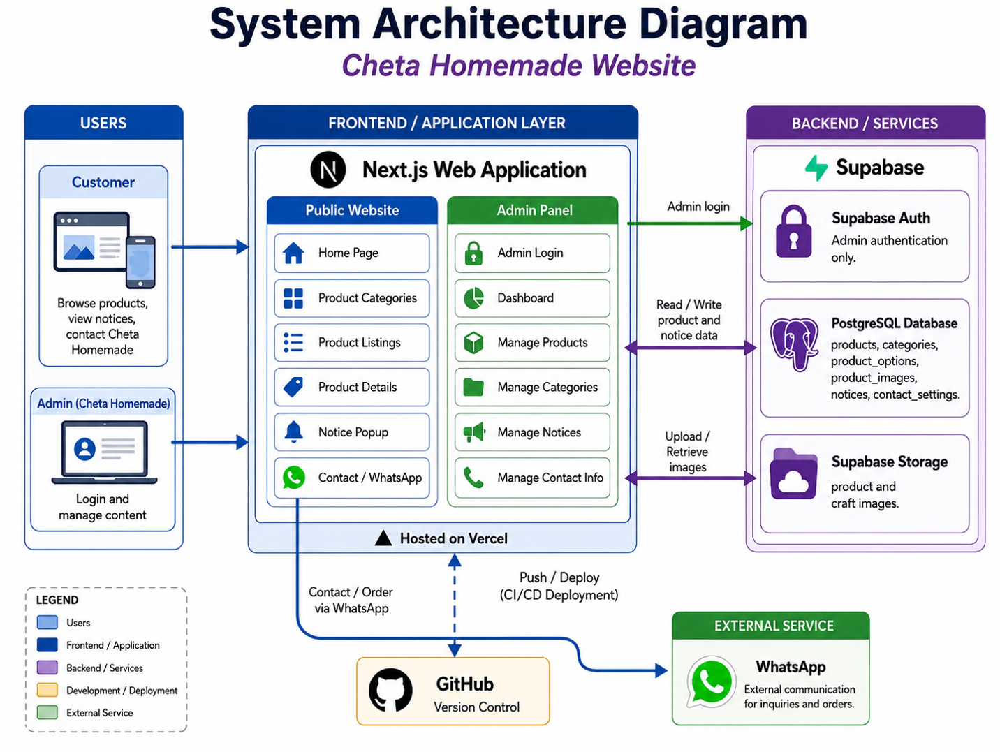

# Cheta Homemade Website


A personal website I built for my mom’s home-based business, **Cheta Homemade**, to showcase her cakes, pastries, desserts, buns, and craft items. It includes a separate admin panel so products, categories, notices, images, and contact information can be managed without editing the source code.

## Current Version

This version is connected to Supabase and no longer uses hardcoded product data, mock data, or browser `localStorage` for business content.

Supabase provides:

- Admin authentication
- PostgreSQL database
- Row Level Security
- Dynamic categories and category ordering
- Dynamic products and price options
- Product image uploads through Supabase Storage
- Dynamic notices
- Dynamic contact settings

## Main Features

### Customer Website

- Home page
- BM and English language switch
- Dynamic Products dropdown
- Product listing and category filtering
- Product detail pages
- Dismissible notice
- Contact page
- WhatsApp order button
- No customer login required

### Admin Website

- Secure Supabase admin login at `/admin/login`
- Dashboard
- Add, edit, delete, and arrange categories
- Add, edit, hide, show, and delete products
- Upload product images
- Manage bilingual notices
- Manage bilingual contact information
- Responsive admin navigation

## System Architecture



The frontend is built with Next.js and deployed through Vercel. Customer and admin pages communicate with Supabase for authentication, database records, Row Level Security authorization, and product image storage. GitHub is used for source control and Vercel deployment.

## Setup

Follow the complete guide:

```text
SUPABASE_SETUP.md
```

Quick local setup:

```bash
npm install
npm run dev
```

Required `.env.local` values:

```env
NEXT_PUBLIC_SUPABASE_URL=
NEXT_PUBLIC_SUPABASE_PUBLISHABLE_KEY=
```

Do not commit `.env.local` or use the Supabase service-role key in this application.

## Database Definition

Run this file in Supabase SQL Editor:

```text
supabase/schema.sql
```

The database starts empty so all real Cheta Homemade business data can be entered from the admin dashboard.

## Routes

### Customer Routes

| Page | Route |
|---|---|
| Home | `/` |
| Products | `/products` |
| Category | `/products/[category]` |
| Product Details | `/products/item/[id]` |
| Contact | `/contact` |

### Admin Routes

| Page | Route |
|---|---|
| Admin Login | `/admin/login` |
| Dashboard | `/admin/dashboard` |
| Products | `/admin/products` |
| Add Product | `/admin/products/new` |
| Edit Product | `/admin/products/[id]/edit` |
| Categories | `/admin/categories` |
| Notices | `/admin/notices` |
| Contact Settings | `/admin/contact` |
